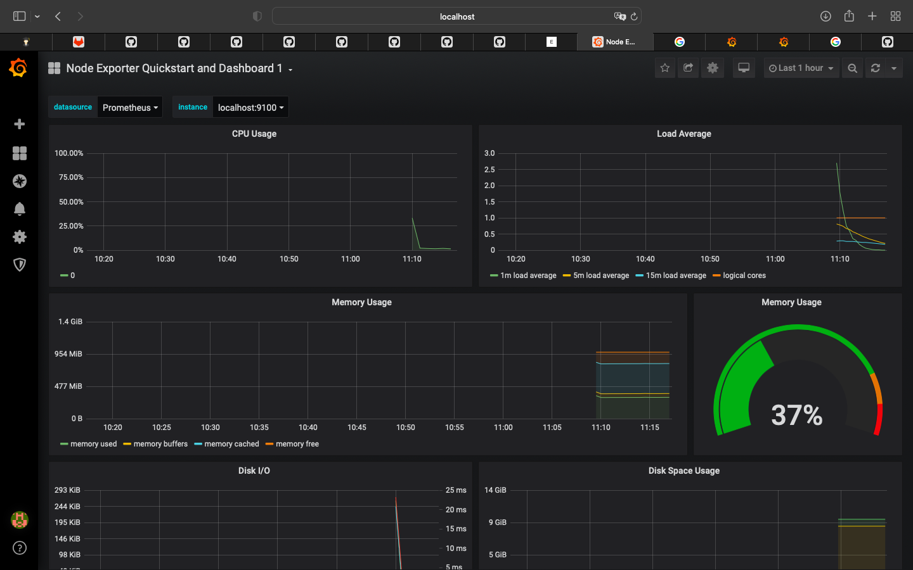
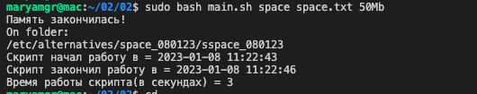
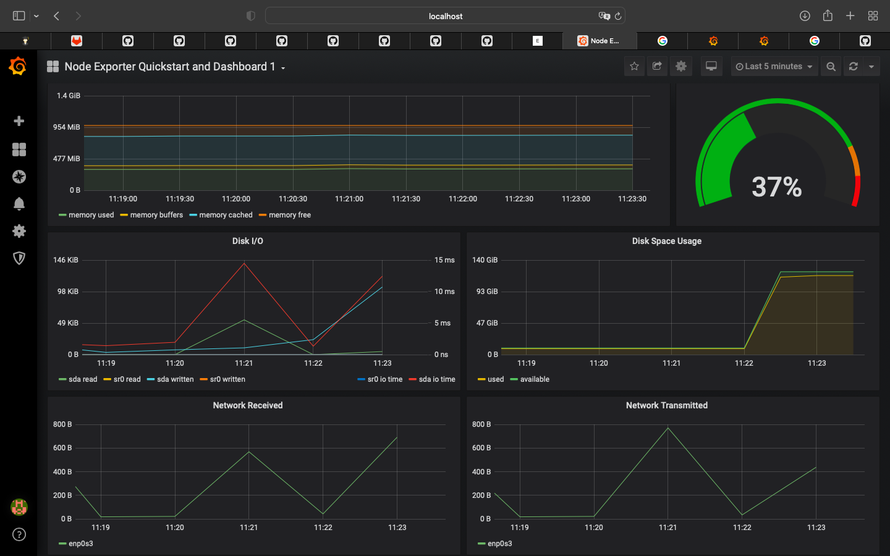
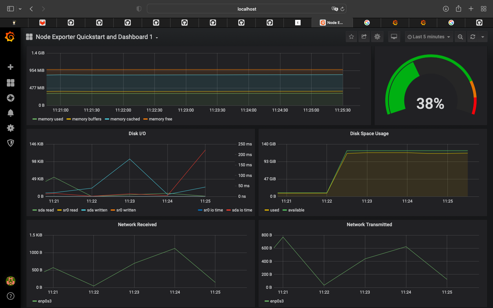
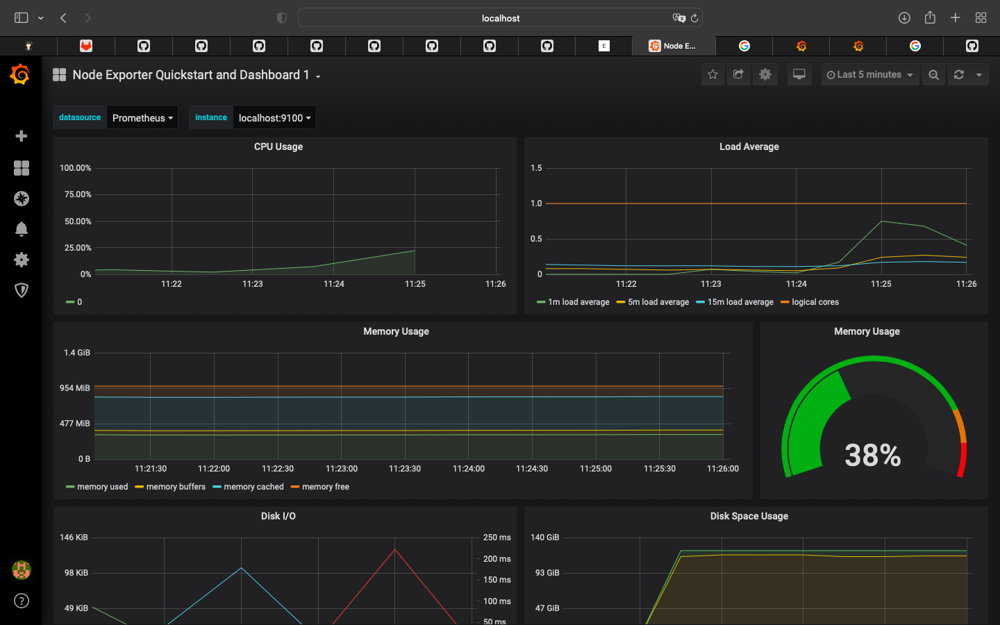
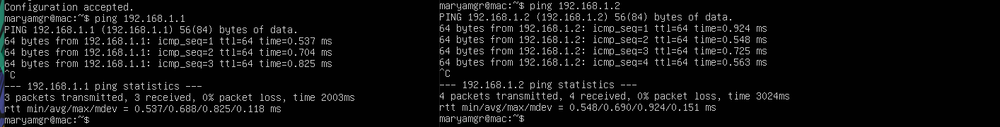
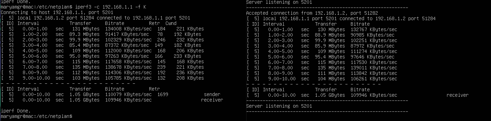
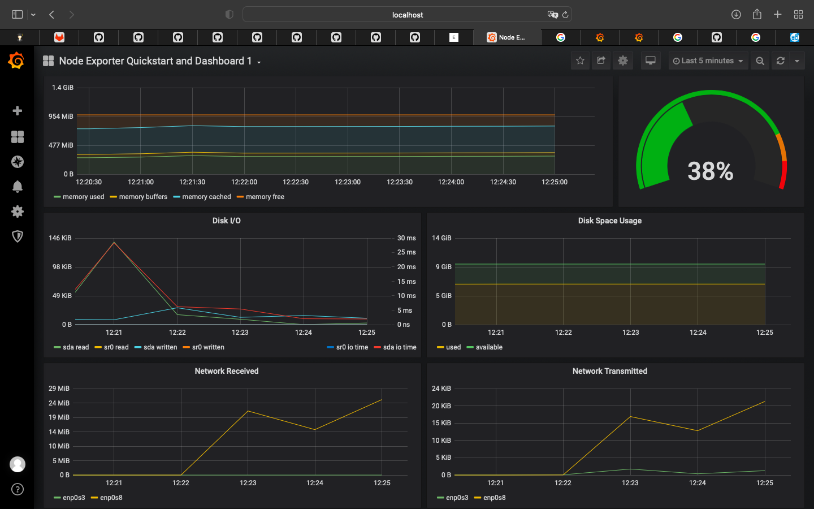

# LinuxMonitoring v2.0

## Part 8. Готовый дашборд
**Prometheus** port 9090 (http://localhost:9090)
**Grafana** port 3000 (http://localhost:3000)
* Установить готовый дашборд Node Exporter Quickstart and Dashboard с официального сайта Grafana Labs

* Запустить ваш bash-скрипт (#part-2-засорение-файловой-системы)

* Посмотреть на нагрузку жесткого диска, оперативной памяти и ЦПУ `stress -c 2 -i 1 -m 1 --vm-bytes 32M -t 10s`

* Запустить ещё одну виртуальную машину, находящуюся в одной сети с текущей

* Запустить тест нагрузки сети с помощью утилиты iperf3.Посмотреть на нагрузку сетевого интерфейса

